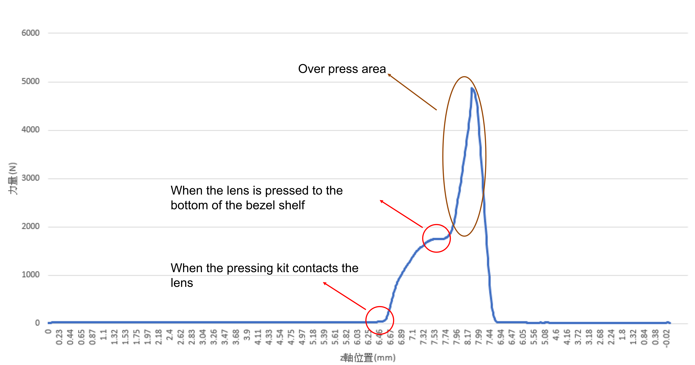
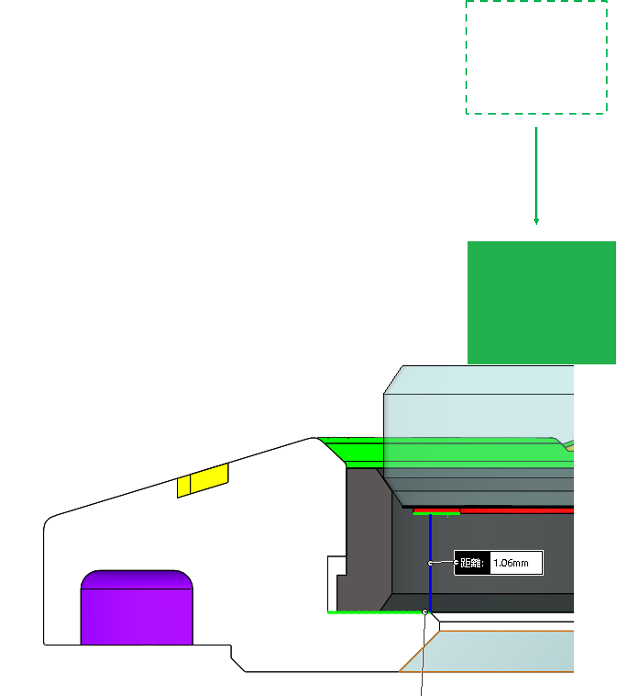
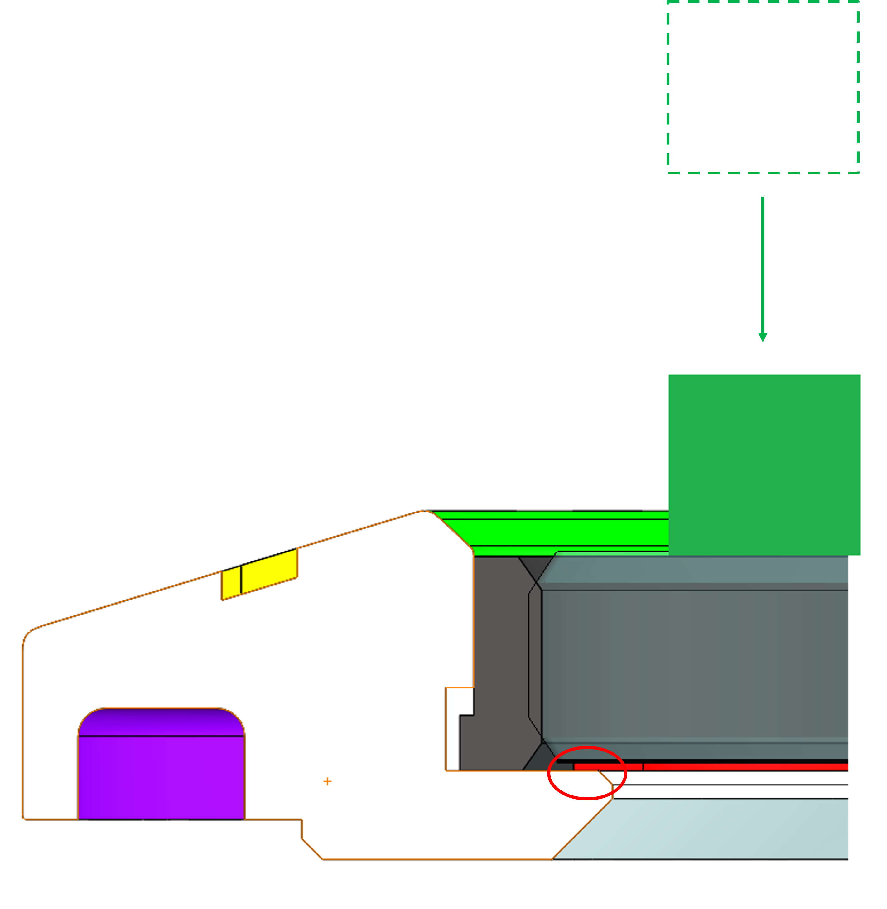
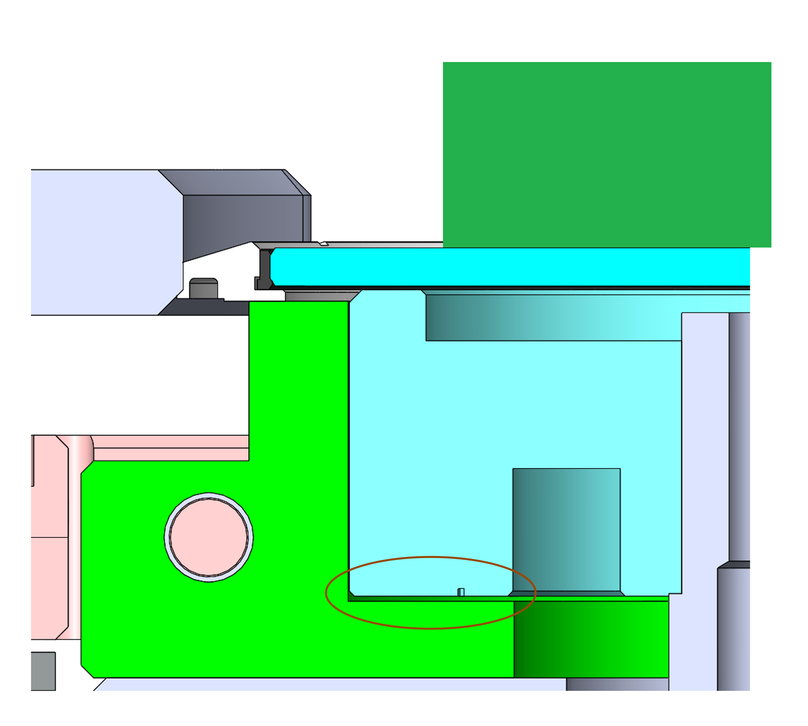
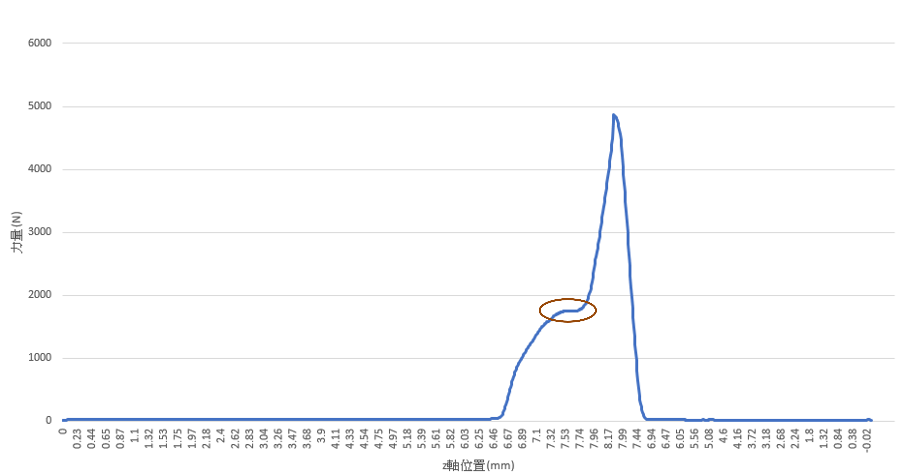
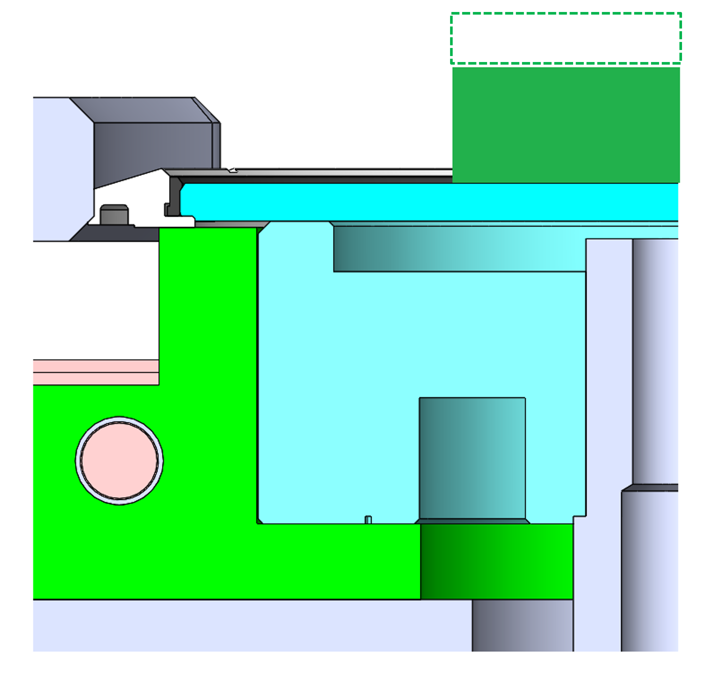
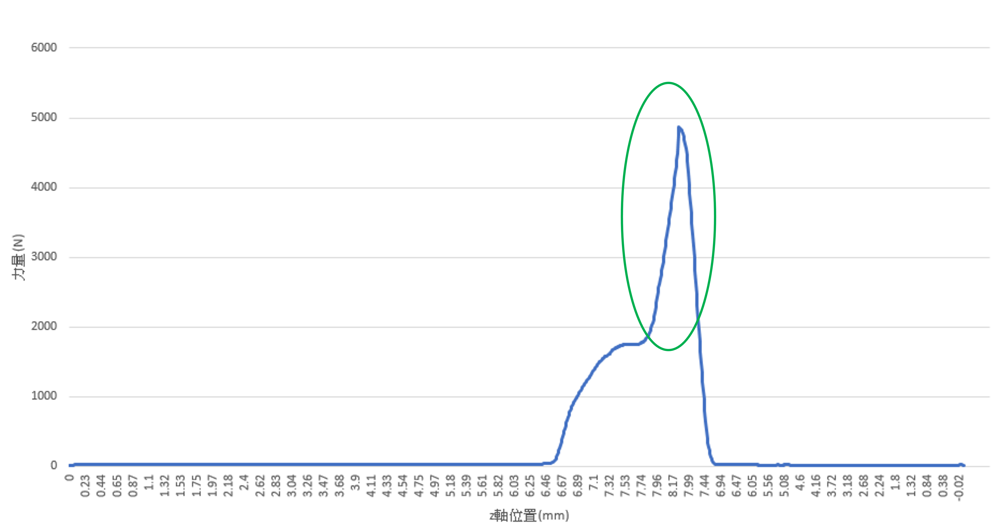
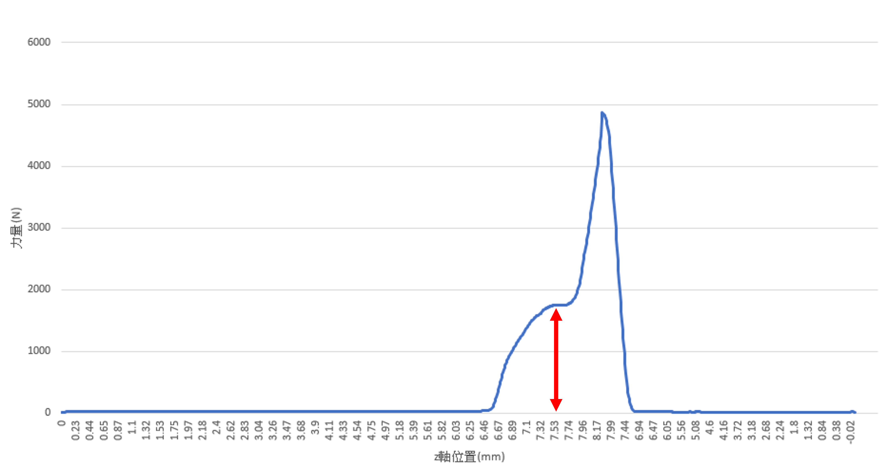

# 2. Defining Features

## 2.1 Overview of the Pressure Plot

So, there are several ways to find them, and we adopted the most straightforward method - <mark style="background-color:red;">observing</mark>. In order to see its shape and evaluate whether it could really become a noticeable feature, we can see their plot first.

### 2.2 Dynamically Features Introduction

It could be divided into several phases, the first important point happens when the lens touch the bezel. In other words, it starts <mark style="background-color:red;">generating interference</mark> at this time point.

 .png>)

Later on, the press machine would push the lens one way down, that is the <mark style="background-color:red;">phase of finishing pressing</mark>. And the force would arrive the first peak, that is noticeable.

 .png>)

And there would stay the <mark style="background-color:red;">same pressure for a while</mark>, because it means that it <mark style="background-color:red;">presses to the bottom</mark>.

 

However, we need to be aware that the peak behind the first peak is not that important, that is just the <mark style="background-color:red;">redundant pressing phase</mark>.

 

One of the feature we discovered first is the interference of lens and bezel. It would be a little difference between different models of product, for example, the designed interference of Fenix 7 is 0.11 mm. So we premise that the <mark style="background-color:red;">smaller the difference between designed interference and real interference, the more possible the product would be successful.</mark>

.png>) .png>)

### 2.3 Another feature

It would be <mark style="background-color:red;">not solid</mark> to use only one feature to decide the product is fail or not, and it is not suitable for machine learning phase. So, we proposed and supposed that the <mark style="background-color:red;">difference of pressure when the interference happens</mark> might be one of the feature. And we'll test whether it can bring positive effect to this project.

.png>) 
