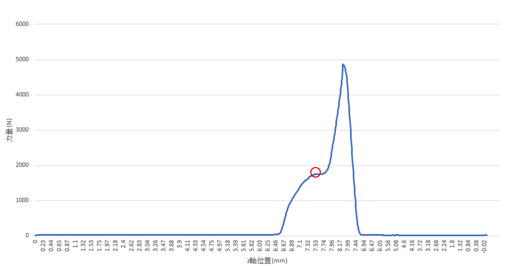

# 3. Finding Features

### 3.1 Part 1 Structure

To be short, we want to clean the data and then store the useful chunk into our data base. So, the structure of these moves can be simplified as follow,

.png>)

### 3.2 Data Searching and Cleaning

We need to define an algorithm to <mark style="background-color:red;">automatically find these feature</mark>, instead of finding the log file, finding out the numbers and then transforming the data into the plot, and then find the rising point, and the smoothing point (first peak).

.png>)

These files above are real log file in pressing machine, and the content inside is <mark style="background-color:red;">messy and full of a lot of things</mark>. It is like:

.png>)

And the data we want is hidden in this massively informative file, like&#x20;


How can we clean the file and <mark style="background-color:red;">extract the part of time series data</mark> we want?&#x20;

```python
def FindInterfereDistanceNew(file):
    global count
    global s
    global n
    f = open (file)
    lines = f.readlines()
    alist = []
    for line in lines:
        if len(line.split(';')) == 4 :
            alist.append(line.split(';')[2])
    def solve(lis):                                        
        for x in lis:
            try:
                yield float(x) 
            except ValueError:    
                pass
    list(solve(alist)) 
    import numpy as np
    a = list(solve(alist)) 
    a_list = list(a)
```

After this process, the extracted data would be like,

.png>)

By the way, if we would like to build the data base for storing these data, then we can use this process. But you should keep in mind that it is not a necessary step if we only want to build the machine learning model, the function if this is to make these data can be orderly stored.

```python
def RawDataToDatabase(file):
    def ExtractData(file):
        f = open (file)
        lines = f.readlines()
        
        alist = []
        for line in lines:
            if len(line.split(';')) == 4:
                alist.append(line.split(';')[2])
                
        for x in alist:
            try:
                yield float(x)
            except ValueError:
                pass
        alist = list(alist)
    
    def AppendListAsRow(file_name, list_of_elem):
        with open(file_name, 'a+', newline = '') as write_obj:
            csv_writer = writer(write_obj)
            csv_writer.writerow(list_of_elem)
    
    row_content = ExtraData(file)
    AppendListAsRow('xxx.csv', row_content )
```

The effect is as follows,

.png>)

### 3.3 Part 2 Structure

Back to the main research process. Here is the flow chart of this part of the research

.png>)

### 3.3 Difficulty of finding these points

First of all, there will also be <mark style="background-color:red;">a lot of fluctuations</mark> before the rising point, which will cause <mark style="background-color:red;">misjudgment</mark>

.png>)

Besides, <mark style="background-color:red;">false peaks</mark> are big issues as well.

.png>)

On top of that, sometimes there are some flat shape before the peak,

.png>)

Or the peak is <mark style="background-color:red;">not easy to observe</mark>,

.png>)

Lastly, there are <mark style="background-color:red;">multiple peaks</mark> show up around the same time, it would be difficult to decide which peak is the right one or more suitable one.

.png>)

### 3.4 Solution

So, the a\_list will be a time series data, it means that the data is in time order and can be plotted as follow. Then we need to find the first rising point as follow as well.

.png>)

It is just like a <mark style="background-color:red;">sliding window</mark> to check two points of the window(left point and right point), and once the difference is too big, that means that it is going to rise. The meanings of sliding window can be divided into two parts,

* sliding: This window is one-way moving, that is, the movement is forward in time order.
* window: The window size is not fixed, it can continue to expand until certain conditions are met, or it can continue to shrink until a minimum window that satisfies the conditions is found; of course, it can also be a fixed size.

When designing the window, there are something need to be aware of:

* Closed window <mark style="background-color:red;">size</mark>
* The degree of <mark style="background-color:red;">fluctuation</mark> of the left and right endpoints
* <mark style="background-color:red;">Start</mark> sliding time point
* <mark style="background-color:red;">Pause</mark> time

So, the graph below show our method and algorithm of finding first target, that is to find the first rising point.

.png>)

```python
a_list = list(a)
    counter = 420
    for i in range(420,len(a_list)):
        if a_list[i+5]-a_list[i]> 10:
            counter = counter+1
            break
        else:
            counter = counter+1
    counter = counter+4
```



```python
 for s in range(counter,len(a_list)):
        if a_list[s] > a_list[s-1] and a_list[s] > a_list[s+1] and s-counter > 50:
            break    
```

### 3.5 Inspect the Result

It can be seen from making plots to inspect whether the algorithm is good enough, that is, whether the method we applied can precisely find the initial point and the peak. And the result from plots show that it is a robust and proper way for the target points.

.png>)

Moreover, we can magnify the key period and look closer.

.png>)

### 3.6 Review the process until now


