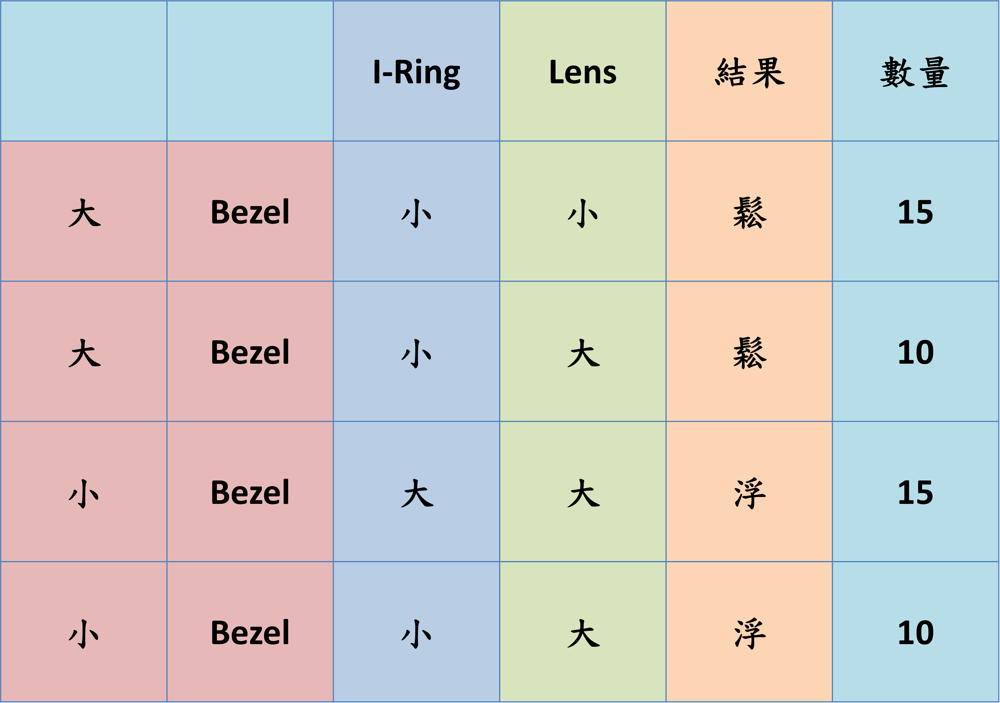

# 4. Data Unbalance

It is not correct to directly put the fail data into training set, because the ratio between fail and successful ones is approximately <mark style="background-color:red;">0.01</mark>. If we put this unbalanced dataset into machine learning algorithm, we would get a model with high accuracy but with no ability to identify the product is fail or not, because computer knows <mark style="background-color:red;">even it says all the products is correct, the accuracy would still be 99%.</mark>

After we know the features for machine learning algorithm, we took a look into the data we collected. However, it is not good to see that the data is extremely unbalanced, it means that the fail data collected from product line is so scarce that it could not be put into training set.

Here, I think it is not proper to use SMOTE to randomly generate dataset, because we have only two features.

So, we need to launch the <mark style="background-color:red;">experiment to generate fake fail data set</mark>, and here are some parameter we designed for this project.&#x20;

As a result, we can generate around 50 pics of fail models, then we can cut the data of correct ones into this size, then bound them together for training.
