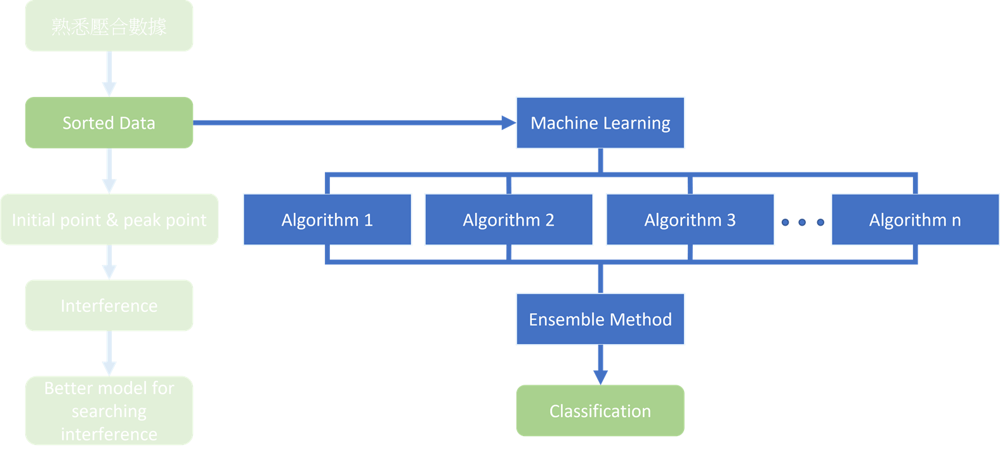

# 5. Machine Learning Structure

### 5.1 Overview of Machine Learning Process

### 5.2 Try and Error

At the beginning, we want to bring <mark style="background-color:red;">peak pressure</mark> into the machine learning model training as another feature value.

.png>)

### 5.3 New Feature Discovering

However, after conducting a series of experiments, we can say that the peak pressure it not the key factor which has the ability to decide the product is fail or not. So, we deduce that maybe the <mark style="background-color:red;">pressure difference</mark> between the initial point and peak can be a feature.

.png>)
