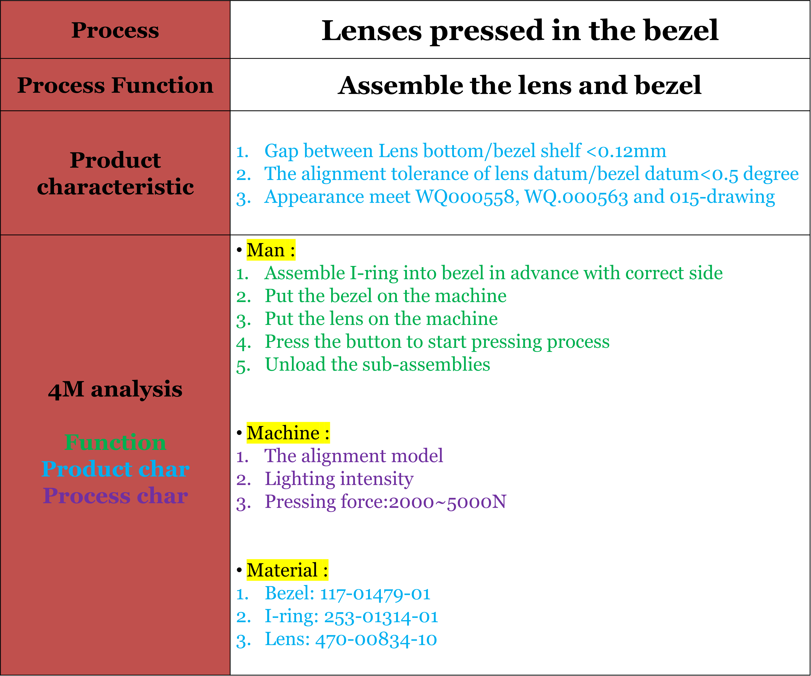
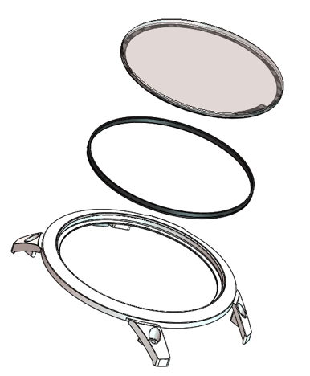
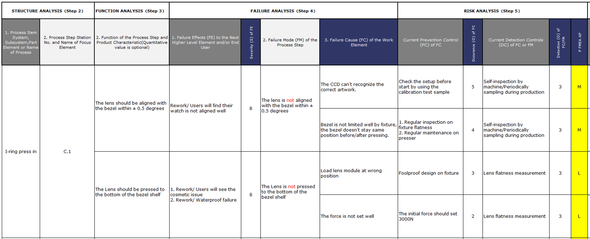

# 1. ML Project

### 1.1 Introduction

 

###

### 1.2 Why Machine Learning Can Be Used Here

Nowadays, operators in produce lines need to use some tool to check whether lens, I-Ring and bezel are pressed well after they were tied together. However, there is a chance to apply machine learning to <mark style="background-color:red;">predict whether the product is pressed fail or successful</mark>, this would increase the <mark style="background-color:red;">efficiency</mark> in these lines, and it means that it can boost the _Units Per Person Hour_ and profits.&#x20;

.png>)

### 1.3 Want to jump right in?

it will start with the machine learning training phase and some difficulties we faced in this phase, including data imbalance, rare features.


[6.-data-preprocessing.md](6.-data-preprocessing.md)


### 1.4 Want to deep dive?

it would start the phase of applying this system into the machine in product lines.


[7.-model-training.md](7.-model-training.md)

